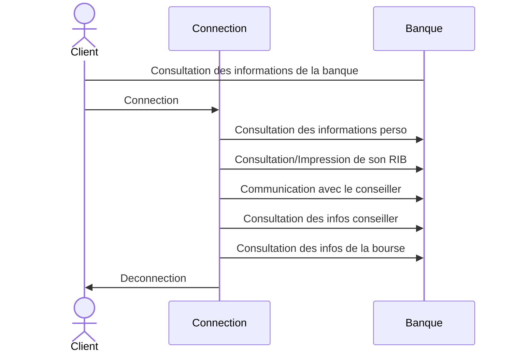
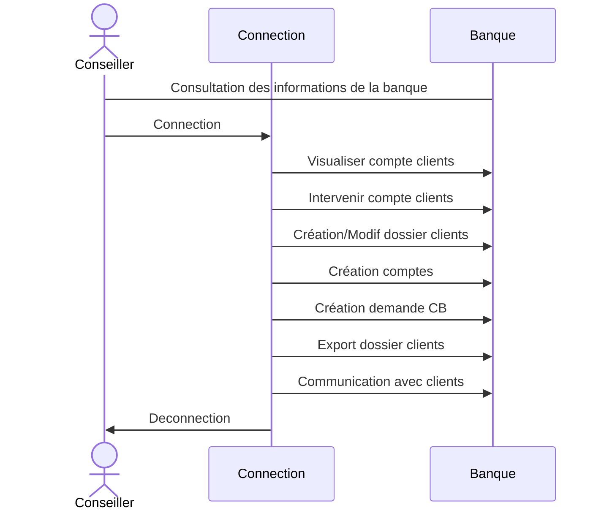
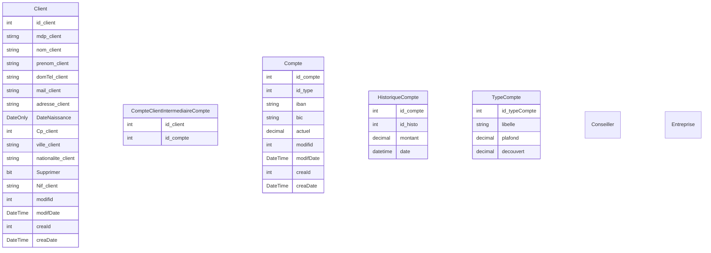

# Cahier des charges du projet de Riri93

## Table des matières

- [Besoin](#Besoin)
- [Fonctionel](#Fonctionnelle)

---------

## Besoin <a id="Besoin"/>

Une banque vous contact car elle possède déjà une infrastructure informatique et technologique ancienne, elle souhaite se renouveler. Cette dernière vous envoie le mail ci-dessous, votre directeur hiérarchique vous demande de répondre à cette demande.

---------

### Mail client

Bonjour,

je suis Cécile Simon, secrétaire de direction de la banque CashFund,

Nous souhaitons mettre à jour notre infrastructure technologique bancaire, nous trouvons votre structure peut-être qualifiée. Je vous transmets nos demandes techniques, ainsi que fonctionnelles.

L'infrastructure comporte plusieurs parties :
 - La partie RGBDR permettant le stockage de toutes les données. Elle comporte :
    - Les données clients
    - Les données de transactions
    - Les liaisons avec leur conseiller
    - La gestion des comptes ainsi que leur contrat les liens à notre structure
    - L'historique de communication entre le client et sa/son conseiller
    - L'historique de communication entre les services internes
    - L'historique d'achat et de vente d'actions/obligations financière
 - La partie logicielle (réservé(e)s au salarié(e)s) :
    - Permettant de visualiser les comptes des clients
    - D'intervenir sur le compte en cas de problème (vol, gelation du compte, exportation des relevés bancaires judiciaires)
    - Création d'un dossier client
    - Création d'un compte client (Avec plusieurs choix)
    - Création d'un compte chèque
    - Création de la demande d'une carte bleue (Plusieurs choix)
    - Modification d'un dossier client (changement d'adresse, de conseiller, etc...)
    - Possibilité d'exporté à des fins d'impression des dossiers clients
    - Possibilité de communiqué avec le client
 - La partie web (réservé au client)
    - Permettant la consultation des informations
    - Permettant la consultation de ces comptes
    - Permettant la consultation/impression de son RIB
    - Pour les clients ayant souscrit à certains contrats
        - Accès au cours de la bourse
        - Achat/Vente d'actions
    - Communication avec le conseiller
    - Consulter les horaires du conseiller
 - Si possible /!\ une partie mobile
    - permettant les mêmes fonctionnalités que le site pour les clients/les conseillers

Nous mettons un point d'honneur sur la sécurité de nos clients. Espérant que les solutions que vous nous proposerez, vous permetteront de répondre au mieux à nos attentes. La technologie Web est à votre guise, cependant, ayant un contrat avec Microsoft, nous vous demanderons de travailler en grande majorité avec les technologies de ces derniers concernant notre logiciel et base de données.

Au vu des dangers de la conjoncture cybercriminelle actuelle, nous avons besoin d'une solution sûre et pérenne.

Merci, de nous transmettre votre cahier des charges si vous êtes intéréssé par notre offre.

Nous aimerions que celui-ci possède des parties fonctionnelles ainsi que des parties très techniques que nous transmettront à notre responsable en charge de cette transition technologique. Nous permettant ainsi d'évaluer la pertinence de votre proposition face à vos concurrents.

En vous remerçiant,

Cordialement,

Cécile Simon, 
Secrétaire de direction de la banque CashFund

--------------------------------

## Objectif

L'objectif de ce projet est de réalisé un cahier des charges dans un premier temps

----

## Fonctionnelle <a id="Fonctionnelle">

### Client

------

### Salarié

## Technique

### BDD

